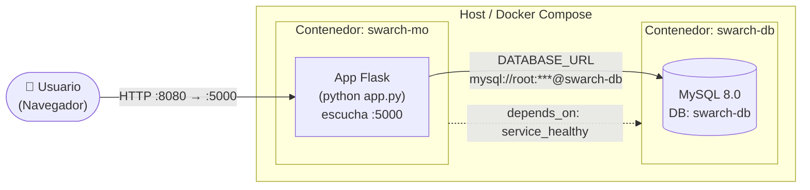
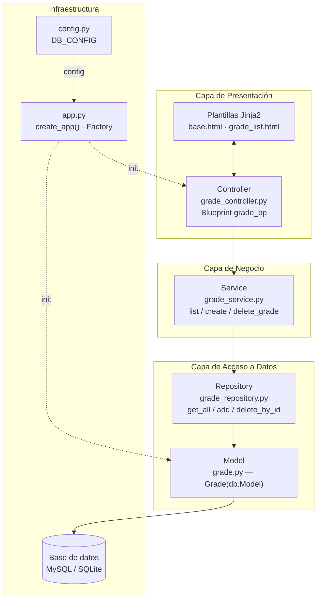
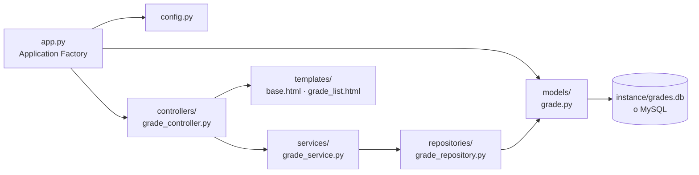
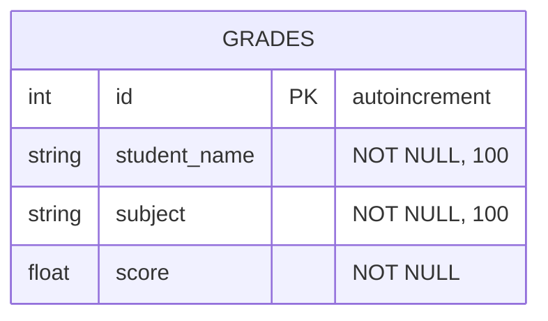
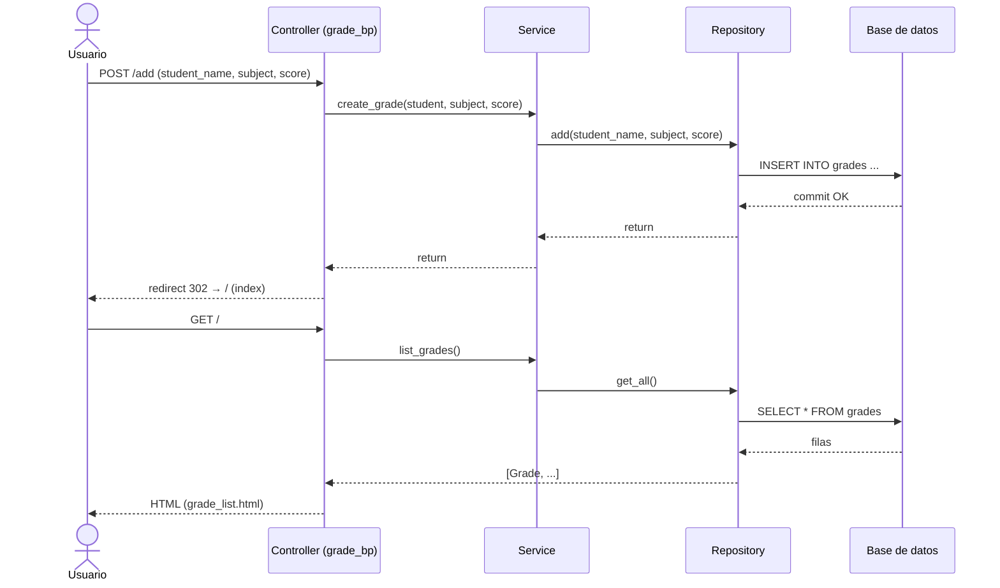

# Gestor de Calificaciones — Representación de la Arquitectura

Aplicación web construida con **Flask** siguiendo una **arquitectura en capas**
(Layered Architecture), persistencia con **SQLAlchemy** y despliegue mediante
**Docker Compose** contra una base de datos **MySQL 8.0**.

---

## 1. Vista de despliegue (Docker Compose)

Muestra los contenedores, sus puertos y cómo se comunican.

**Notas de despliegue**
- Puerto publicado: `8080` (host) → `5000` (contenedor).
- Volumen `.:/app` monta el código dentro del contenedor (hot-reload en desarrollo).
- `swarch-mo` espera a que `swarch-db` esté *healthy* (healthcheck con `mysqladmin ping`).
- Conexión a la BD vía variable de entorno `DATABASE_URL`.

---

## 2. Vista de capas (Layered Architecture)

Flujo de una petición HTTP a través de las capas del sistema.

**Regla de dependencia:** cada capa solo conoce a la inmediatamente inferior
(Controller → Service → Repository → Model → DB). La presentación nunca accede
directamente a los datos.

---

## 3. Diagrama de componentes / módulos

---

## 4. Modelo de datos

---

## 5. Flujo de una petición (secuencia)

Ejemplo: agregar una calificación (`POST /add`).

---

## 6. Endpoints expuestos

| Método | Ruta                 | Controller | Acción                         |
|--------|----------------------|------------|--------------------------------|
| GET    | `/`                  | `index`    | Lista todas las calificaciones |
| POST   | `/add`               | `add`      | Crea una calificación          |
| GET    | `/delete/<grade_id>` | `delete`   | Elimina por id                 |

---

## 7. Stack tecnológico

- **Lenguaje:** Python 3.11
- **Framework web:** Flask 2.3.3
- **ORM:** Flask-SQLAlchemy 3.1.1
- **Driver BD:** mysqlclient 2.2.0
- **Base de datos:** MySQL 8.0 (producción) / SQLite (fallback local)
- **Contenedores:** Docker + Docker Compose
- **Vistas:** Jinja2 (templates HTML)
